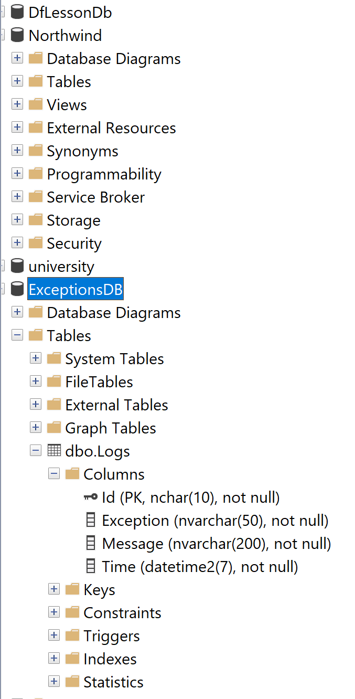

# Лабораторная работа №4

От нас требовалось создать новую службу, которая на основе данных из базы данных (в моем случае Northwind) считывает определенную модель и создает xml файл, содержащий эти данные.
Так же нужно было прикрутить службу из 3 лабы, которая отслеживает добавление новых файлоа в clientDirectory, делает нужные действия и переносит в targetDirectory

Я делал модель заказа, которая основывается на таблице Order и ее составляющих из БД Northwind

## Архитектура:
- ConfigurationManager - библиотека для конфигурации, разработанная в 3 лабе.

- FileManager - служба из прошлой рабораторной, которая отслеживает добавление файлов в clientDirectory, делает нужные действия и кидает в targetDirectory

- Northwind.DataAccessLayer - слой работы с базой данных. В библиотеке есть 2 папки: interfaces и implementations, для адекватного разделения интерфейсов и их реализации.

- Northwind.DataManager - собственно новая служба, которая генерит xml файл на основе данных и кидает его в clientDirectory

- Northwind.Models - библиотека для моделей службы. Там есть модели заказа и ошибки.

- Nortwind.ServiceLayer - библиотека ServiceLayer - слой для работы с DataAccessLayer. Так же содержит 2 папки: interfaces и implementations.

- configs - содержит файл конфигурации, с которого берутся опции, необходимые как для службы FileManager, так и для Northwind.DataManager

- procedures - содержит процедуры-запросы, которые необходимы для получения набора данных из бд Northwind. Там лежит 3 процедуры - достать заказ по id, достать 30 заказов, отправить сообщение об ошибке в отдельную базу данных (ExceptionsDB)

Так же сделана отдельная база данных (ExceptionsDB), в которой содержится таблица Logs, для логирования ошибок

